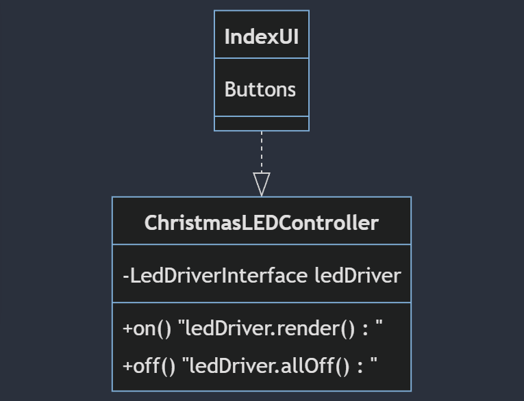
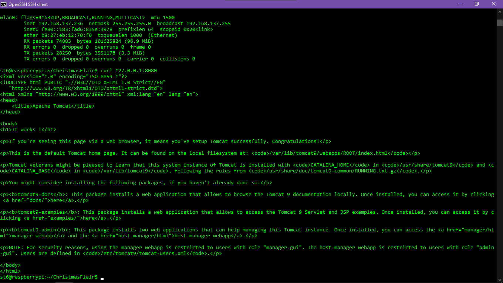

# ChristmasFlair

# 11/3/2023

I just yesterday realized that the webapp is meant to run through the Pi, not the PC. Oops. 


Accessing server on Pi via 127.0.0.1:8080


Accessing server on PC via 192.168.x.x:8080


NEW ISSUE: I don't know how to put my application on to the Pi. I can compile it easily in Maven on Windows but the WAR file doesn't seem to work when I transfer it to the Pi. 

# 11/1/2023

Now that everything is functioning, it's time to integrate Maven / Spring-boot / Tomcat. I already broke the repo once. Pushing the most up-to-date, working version right now in case it happens again.


Success!!!


diozero-distribution-1.3.5 does not appear to contain diozero.com.ws281xj.* - using 1.3.4 instead fixes all of my library issues instantly.

# 10/31/2023

Quick demo (sorry for audio): https://youtu.be/qltSgunkI-c?si=-mrhQbPm-9-Cjl-p

# 10/28/2023

For the first time, this repo has a functioning program! It's capable of running 5 different methods that control the LED strip. 4 of them are animations, 1 of them is a "set color & brightness" method. 

"The drawback with Command design pattern is that the code gets huge and confusing with high number of action methods and because of so many associations."
Welp...


# 10/26/2023 

Command pattern has been solved. I was returning "this.led" as null on 10/14/2023 because the Receiver was being utilized improperly. Client now has a Scanner for user input. 

EDIT: While updating the code on a CR system, I accidentally pushed & committed some stuff while under the wrong username. I thought I signed in on my account but I guess I did something wrong. If you see another username in the commit message history, that's why. Just felt it important to clarify that.


# 10/14/2023

For this sprint, I did two things: 


1.) Made an LedAnimations class (in src directory) which contains a rainbow method and a strobe method. 


2.) Attempted to work with the Command design pattern to make a way for the user to access different animations. This can be found in the directory titled "Command_Idea".


My command design pattern doesn't seem to be properly written yet. I get the following error:

```
Exception in thread "main" java.lang.NullPointerException: Cannot invoke "Command_Idea.LedReceiver.rainbowCommand()" because "this.led" is null
	at Command_Idea.RainbowCommand.execute(RainbowCommand.java:14)
	at Command_Idea.LedInvoker.execute(LedInvoker.java:10)
	at Command_Idea.LedClient.main(LedClient.java:12)
```
I think this is because I am putting the code for the animations in the wrong place. 

Below is the UML diagram for what I have in mind. It's very similar to the FileSystemReceiver example we went over in class.

```
classDiagram
    RainbowCommand ..|> LedCommand :implements
    RainbowCommand --> LedReceiver
    StrobeCommand ..|> LedCommand :implements
    StrobeCommand --> LedReceiver
    LedInvoker --> LedCommand
    LedClient --> LedReceiver
    LedClient --> RainbowCommand
    LedClient --> StrobeCommand
    LedWs281xReceiver ..|> LedReceiver :implements
    LedSignReceiver ..|> LedReceiver :implements

    class LedCommand{
        <<interface>>
        +execute() : void
    }

    class RainbowCommand{
        -LedReceiver led
        +RainbowCommand(LedReceiver ledReceiver)
        +execute(): void "led.rainbowCommand()"
    }
    class StrobeCommand{
        -LedReceiver receiver
        +StrobeCommand(LedReceiver receiver)
        +execute(): void "led.strobeCommand()"
    }

    class LedReceiver {
        <<interface>>
        +rainbowCommand() : void
        +strobeCommand() : void
    }
    class LedWs281xReceiver {
        +rainbowCommand() : void
        +strobeCommand() : void
    }
    class LedSignReceiver {
        +rainbowCommand() : void
        +strobeCommand() : void
    }

    class LedInvoker {
        -LedCommand command
        +LedInvoker(LedCommand c)
        +execute()
    }

    class LedClient{
        LedReceiver ledReceiver
        RainbowCommand rainbowCommand
        StrobeCommand strobeCommand
        LedInvoker ledInvoker
        +execute()
    } 
```
# 9/23/2023

This is where my mermaid.live class diagram currently stands. The goal of this diagram is to make a set of animations that the user can choose by utilizing the decorator design pattern. Current animation ideas include strobe, scroll, and rainbow.


```classDiagram

LedStatic ..|> Led : implements
LedAnim ..|> Led : implements
LedScroll --|> LedAnim : extends
LedStrobe --|> LedAnim : extends
LedRainbow --|> LedAnim : extends
LedAnim *-- Led : extends

class Led{
<<interface>>
+render()
}

class LedStatic{
+LedStatic()
+render()
+delay()
}

class LedAnim{
led wrappedLed
+ledAnim(Led)
+render()
+delay()
}

class LedScroll{
+ledScroll(Led)
+render()
+delay()
}

class LedStrobe{
+ledStrobe(Led)
+render()
+delay()
}

class LedRainbow{
Object newState
+ledRainbow(Led)
+render()
+delay()
}
```

